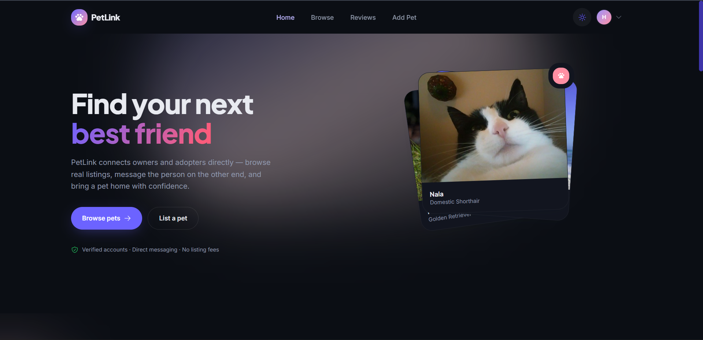
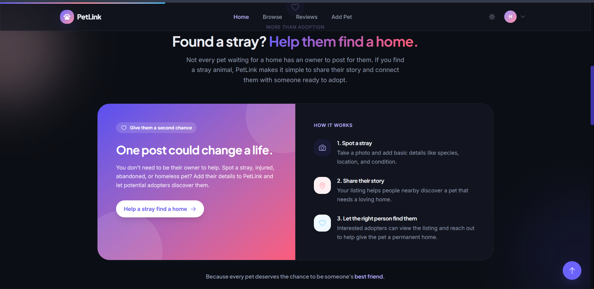
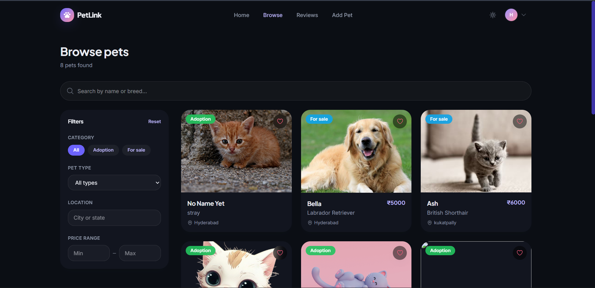

# PetLink 🐾

PetLink is a full-stack pet adoption and pet listing platform that helps
users discover pets, publish pets for adoption or sale, and connect with
potential adopters or buyers.

## 🚀 Live Demo

[Visit PetLink](https://pet-link-xi.vercel.app)

## Project Structure

``` text
PetLink/
├── client/     # React frontend
├── server/     # Node.js/Express backend
└── README.md
```

## Tech Stack

### Frontend

-   React 19
-   Vite
-   Tailwind CSS

### Backend

-   Node.js
-   Express.js
-   MongoDB
-   Cloudinary

## 📸 Screenshots

### Home Page



### Home page



### Pet Listings




## Getting Started

### 1. Clone the repository

``` bash
git clone <your-repository-url>
cd PetLink
```

### 2. Setup the Backend

``` bash
cd server
npm install
```

Create a `.env` file inside `server`:

``` env
PORT=5000
MONGO_URI=your_mongodb_connection_string
ACCESS_TOKEN_SECRET=your_jwt_secret

CLOUDINARY_CLOUD_NAME=your_cloudinary_cloud_name
CLOUDINARY_API_KEY=your_cloudinary_api_key
CLOUDINARY_API_SECRET=your_cloudinary_api_secret
```

Use the exact environment variable names required by the backend
configuration.

Start the backend:

``` bash
npm start
```

or, if a development script is configured:

``` bash
npm run dev
```

### 3. Setup the Frontend

Open another terminal:

``` bash
cd client
npm install
```

Create a `.env` file inside `client`:

``` env
VITE_API_URL=http://localhost:5000
```

Use the production backend URL when deploying.

Start the frontend:

``` bash
npm run dev
```

Create a production build:

``` bash
npm run build
```

## Features

-   User registration and login
-   JWT-based authentication
-   Protected routes
-   User profile management
-   Add pet listings
-   Browse pet listings
-   View individual pet details
-   Pet adoption listings
-   Pet sale listings
-   Image uploads through Cloudinary
-   Manage personal pet listings
-   Delete pet listings
-   Responsive user interface
-   Loading, empty, and error states
-   Toast notifications and animated interactions


## Pet Listings

Users can create listings for:

-   **For Adoption**
-   **For Sale**

Pet images are uploaded to Cloudinary and the resulting image URLs are
stored in MongoDB.

## API Overview

### Authentication

``` text
POST /users/register
POST /users/login
GET  /users/current
PUT  /users/update
```

### Pets

``` text
POST   /pets
GET    /pets
GET    /pets/:id
GET    /pets/user/:userId
DELETE /pets/:id
```

- ⚙️ **Backend API:** [PetLink API](https://petlink.onrender.com)

**PetLink --- Connecting pets with people who care. 🐾**
